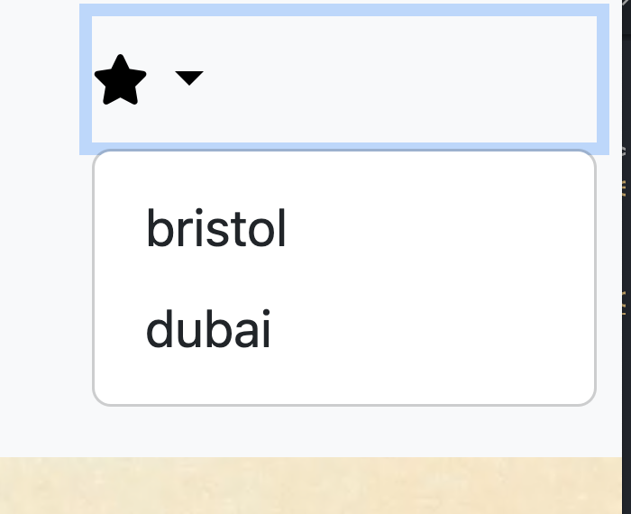

# iWeather

</a>

## UX Design

## Wireframe Design

### Landing Page 

### Login Page 

### Today Forecast 

### 7 day Forecast 

### Mobile Page 

## User Stories

- Search for a Location: As a user, I want to be able to search for a specific location so that I can see the weather forecast for that area.
- Find Current Location: As a user, I want to click a button to find my current location so that I can get weather updates for where I am without manually entering my location or clicking on my geolocation button.
- View Map of the Location: As a user, I want to see a map of the selected location so that I can visually understand where the weather forecast is being applied.
  -Today's Weather Forecast: As a user, I want to see today's weather forecast including the date, temperature, wind direction, humidity, and precipitation so that I can plan my activities accordingly.
- 5-Day Weather Forecast: As a user, I want to see a 5-day weather forecast including dates, temperature, wind direction, humidity, and precipitation so that I can plan my activities accordingly.
- Save Favourite Locations: As a user, I want to save my favourite locations so that I can quickly access the weather forecast for those places without having to search for them again.
- Weather Details Display: As a user, I want detailed weather information including temperature, wind direction, humidity, and precipitation to be clearly displayed for the selected location so that I have all the necessary information at a glance.

As can be seen from the project board, the sprint was composed of 8 separate items. Having used the MoSCoW approach to prioritisation, 4 were classified as "Must-Have" making up 50% of the tasks as recommended. The rest of the first sprint was made up of "Could-Have".

## Features

- **Search Bar**
  The User can instead, enter their own custom location into the Input. Once they click search, the weather API will return weather data for that location.

- **User Location Button**
  The User can click the current location button which uses the Geolocation API, the browser will then ask the User permission to access their device's location. Once that is accepted, the weather results shown will be for that location - using latitude and longitude of the User's device.

- **Live Weather**
  When the User submits a search - current or custom location - the app will display a live weather container. This live weather will have key information about the location. This includes Temperature, Humidity, Wind Speed, Sunrise, Sunset and a description of the weather e.g Cloudy. The user will have an option to expand this into a 5 day forecast.

- **Five Day Forecast**
  In addition to live weather, the User will receive Forecasted Weather for that location. It will provide the User with the next 6 days of weather information - combined with live weather, totals to 7 day weather data. The Forecasted Weather prediction will have minimal but crucial information - date, temperature and weather description.

- **Favourite Locations**
  As an extra feature, the user can save their favourite locations, these will be easily accessible via a icon button which will show the favourites in an organised drowpdown list.

- **Interactive Map**
  When a city is input by the user or the user location is used to execute a search along with the relevant weather information, an interactive map of that location will be displayed below the main section allowing the user to have a browse around the local area, zoom in and out etc. This is generated with Google's map API.

- **Footer**
  At the bottom of the page we have a fairly standard footer section that includes links to each our the collaborators Github pages for the user to checkout.

  

## Testing

### Manual Testing

### Lighthouse

The site was tested using Lighthouse with the following results:

### Responsive Testing

Alongside the built in Bootstrap responsive CSS, media queries were used throughout our own CSS to provide a consistent user experience. Chrome dev tools were used frequently to test the site at standard screen sizes and the site was manually viewed on laptops, tablets and phones.

### Browser Compatibility

The site was tested on the following browsers:

- Opera
- Firefox
- Edge
- Chrome

### Validator Testing

- HTML

  - No errors were returned when passing through the official [_W3C validator_](https://validator.w3.org/ADD LINK)

- CSS
  - No errors were found with our own CSS code when passing through the official Jigsaw validator. However, there were many errors found in the Bootstrap CSS code, which is a normal result.

## Bugs

All bug fixes were dealt with efficiently and cleanly.

- BUG: ADD ANY BUGS FOUND
- BUG:

## Deployment

- The site was deployed to GitHub pages from the main branch of the repository during the developemnt stage for continuous deployment and checking.

- The live link can be found [_here_](https://alice173.github.io/iWeather/)

## Credits

### Content

- Weather API Tutorial: We used this tutorial to produce the initial MVP then modified and added our own Javascript,HTML and CSS
  to add extra functionality and to alter certain design choices [_CodingNepal_](https://www.codingnepalweb.com/wp-content/uploads/2023/06/Create-A-Weather-App-in-HTML-Bootstrap-and-JavaScript.mp4?_=1)

- API: We have registred in the website [_OpenWeather_](https://openweathermap.org/). Here we generated our API KEY and used it to retrieve weather information for our web application.

- JavaSript: In order to retrieve the information from the API we used JavaScript functions such us fetch() and catch().We have used them in combination with other functions in order to manipulate the information from the API.

- BOOTSTRAP: For the main style format and the responsiveness of the website we have used the library [_Bootsrap_](https://getbootstrap.com/). We have used the most recent version 5.3.2

- Photo Editor: For editing our browser photos and testing photos we have used the online editor [_Canva_](https://www.canva.com/en_gb/).

- Google Fonts: For styling purposes We have used fonts from [_Google Fonts_](https://fonts.google.com/).

- CSS: We have added some lines of CSS to style specific parts of our website such as our home image, weather cards, and buttons etc.

- HTML: For the skeleton of our website we have used a basic HTML structure.

### Media

- Favicon: We generated the image using OPEN AI [_DALL-E-3_](https://openai.com/dall-e-3) and we formatted it with the website [_favicon.io_](https://favicon.io/favicon-converter/#google_vignette)

- Weather Icon: We used the icons provided by the API [_OpenWeather_](https://openweathermap.org/)

- The icons in the header and footer were taken from [Font Awesome](https://fontawesome.com/)

- Home Page Image: We selected the image from the website [_Clipground_](https://clipground.com/the-four-seasons-clipart.html%22)

## Future Features

There are various features and user stories that we were not able to implement due to time constraints, but would be added in future iterations of the website.

- Make a personalised profile page that is easily accessible and quick to use.
- Change the background colour based on the temperature of the forecast.

- Add more specificity to search function so that city names that appear in various countries will give a dropdown suggestion so the user can pick which one they want.

### An iWeather Production
